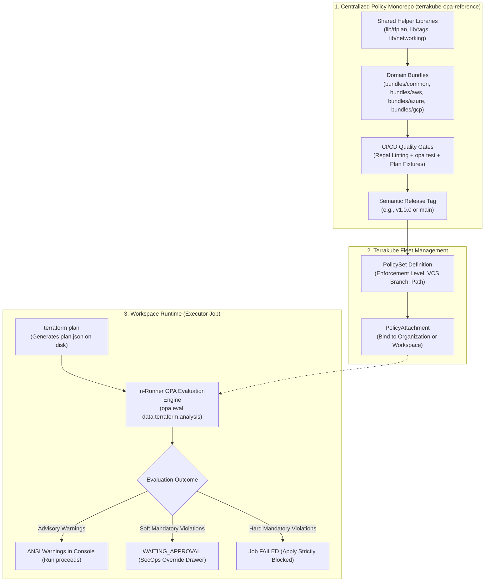

# Terrakube OPA Reference Implementation

[](https://github.com/terrakube-io/terrakube-opa-reference/actions/workflows/test.yml)
[](LICENSE)
[](https://www.openpolicyagent.org/)

A comprehensive reference implementation, best-practice repository layout, and sample guardrails library for Open Policy Agent (OPA) and Rego evaluation in [Terrakube](https://github.com/terrakube-io/terrakube).

---

> [!IMPORTANT]
> **DISCLAIMER: REFERENCE IMPLEMENTATION ONLY**  
> This repository is a **reference example** designed exclusively for demonstration, evaluation, and testing of Terrakube's OPA policy governance capabilities.
> 
> The rules, thresholds, and guardrails provided here (such as tag keys, blast radius metrics, and cloud security configurations) are illustrative samples. They are **not** intended as a drop-in replacement for an organization-specific compliance standard or production security baseline without proper tailoring, testing, and review by your SecOps and cloud architecture teams.

---

## Architecture Overview

Terrakube adopts a centralized GitOps policy model paired with in-runner execution inside both **ephemeral** (Kubernetes Jobs) and **persistent** executor containers:



---

## Directory Structure

```text
terrakube-opa-reference/
├── .github/workflows/test.yml   # CI pipeline: Regal linting + opa test
├── lib/                         # Reusable Rego helper libraries
│   ├── tfplan/                  # Terraform plan parser, change extractors, mode filters
│   ├── tags/                    # Universal tag and label validation
│   ├── blast_radius/            # Deletion counters and weighted risk scoring
│   └── networking/              # CIDR checks and sensitive port detectors
├── bundles/                     # Composable policy bundles (targeted by PolicySets)
│   ├── common/
│   │   ├── tagging/             # [Advisory] Mandatory tags (Environment, Owner, CostCenter)
│   │   ├── blast_radius/        # [Soft Mandatory] Prevents accidental bulk deletions
│   │   └── required_providers/  # [Hard Mandatory] Whitelist of approved provider registries
│   ├── password/                # Cloud-free password policy suite
│   │   ├── advisory/            # [Advisory] Warns if password length < 16
│   │   ├── soft_mandatory/      # [Soft Mandatory] Requires SecOps override if length 8..11
│   │   └── hard_mandatory/      # [Hard Mandatory] Blocks apply if length < 8
│   ├── aws/baseline/            # [Hard Mandatory] S3 public block, EBS encryption, IMDSv2
│   ├── azure/baseline/          # [Hard Mandatory] Storage HTTPS/TLS 1.2, restricted NSG ports
│   └── gcp/baseline/            # [Hard Mandatory] Uniform bucket access, VM public IP ban
├── fixtures/                    # Synthetic terraform show -json plan fixtures for test suites
├── examples/                    # Live Terraform & OpenTofu workspaces demonstrating runtime outcomes
│   ├── compliant-workspace/     # Passes all policy checks
│   ├── advisory-warning-workspace/ # Emits advisory warnings without blocking
│   ├── soft-fail-workspace/     # Triggers soft mandatory override approval
│   ├── hard-fail-workspace/     # Triggers hard mandatory block (exit code 1)
│   ├── password-compliant/      # Cloud-free compliant password (length >= 16)
│   ├── password-advisory/       # Cloud-free advisory warning (length 12..15)
│   ├── password-soft-fail/      # Cloud-free soft mandatory override (length 8..11)
│   ├── password-hard-fail/      # Cloud-free hard mandatory block (length < 8)
│   └── password-exempted/       # Demonstrates PolicyExemption waiver bypassing hard rule
├── terrakube-governance/        # Terraform HCL code to manage policy sets via Terrakube Provider
├── CONTRIBUTING.md              # Policy authoring standards and contract details
└── README.md
```

---

## Pre-Packaged Policy Bundles

| Bundle Path | Target Resources | Enforcement | Description |
| :--- | :--- | :--- | :--- |
| `bundles/common/tagging` | Cloud resources | `advisory` | Warns if `Environment`, `Owner`, or `CostCenter` tags are absent. Configurable via policy inputs. |
| `bundles/common/blast_radius` | All resources | `soft_mandatory` | Halts execution for SecOps approval if `> 5` deletions or weighted risk score `> 25`. |
| `bundles/common/required_providers` | Providers | `hard_mandatory` | Disallows unapproved registries (whitelists HashiCorp, OpenTofu, and internal registries). |
| `bundles/password/advisory` | `random_password` | `advisory` | Cloud-free rule recommending password length >= 16 characters. |
| `bundles/password/soft_mandatory` | `random_password` | `soft_mandatory` | Requires SecOps/Admin override if password length is between 8 and 11 characters. |
| `bundles/password/hard_mandatory` | `random_password` | `hard_mandatory` | Strictly blocks Apply if password length is less than 8 characters. |
| `bundles/aws/baseline` | AWS S3, EBS, EC2 | `hard_mandatory` | Requires S3 public access blocks, EBS volume encryption, and IMDSv2 tokens on EC2 instances. |
| `bundles/azure/baseline` | Azure Storage, NSG | `hard_mandatory` | Enforces HTTPS and TLS 1.2+ on storage accounts; blocks inbound SSH (22) and RDP (3389) from Internet. |
| `bundles/gcp/baseline` | GCP Storage, Compute | `hard_mandatory` | Requires uniform bucket-level access; prohibits public external IP addresses on compute instances. |

---

## Enforcement Levels Explained

Terrakube supports a three-tier enforcement model:

1. **Advisory (`advisory`)**:
   * Evaluated against `data.terraform.analysis.warn`.
   * Displays colored warning messages in the execution logs and Job Details UI.
   * Does **not** block the run; execution proceeds straight to Apply or standard Approvals.
2. **Soft Mandatory (`soft_mandatory`)**:
   * Evaluated against `data.terraform.analysis.soft_mandatory`.
   * When violations occur, the job transitions to `WAITING_APPROVAL`.
   * A user with `ManagePolicyOverride` or `SuperUser` role can inspect the violation and submit an authorized override with a mandatory justification comment.
3. **Hard Mandatory (`hard_mandatory`)**:
   * Evaluated against `data.terraform.analysis.deny`.
   * If any violations are detected, the plan step fails with exit code `1`.
   * `terraform apply` is **strictly blocked**; developers must fix the code before redeploying.

---

## Local Testing & Validation

You can run unit tests and linter checks locally using OPA and Regal:

```bash
# 1. Run all unit tests with verbose output
opa test lib/ bundles/ -v

# 2. Test a bundle against a synthetic plan fixture
opa eval \
  --data lib/ \
  --data bundles/aws/baseline/ \
  --input fixtures/aws-s3-unencrypted.json \
  --format json \
  "data.terraform.analysis"

# 3. Run Regal linter
regal lint lib/ bundles/
```

---

## Deploying to Terrakube via Infrastructure-as-Code

The `terrakube-governance/` directory provides sample Terraform code using the `terrakube-io/terrakube` provider to provision policy sets, create CLI-driven test workspaces, and bind policy attachments automatically:

```bash
cd terrakube-governance/
cp terraform.tfvars.example terraform.tfvars
# Edit terraform.tfvars with your Terrakube API URL and Organization Name (e.g. 'simple')
terraform init
terraform apply
```

`terraform apply` automatically:
1. Provisions the 5 PolicySets (`common-mandatory-tagging`, `common-blast-radius`, `aws-security-baseline`, `azure-security-baseline`, `gcp-security-baseline`).
2. Creates 4 dedicated CLI test workspaces with randomized names (e.g., `opa-eval-compliant-a1b2c3`, `opa-eval-advisory-a1b2c3`, `opa-eval-soft-fail-a1b2c3`, `opa-eval-hard-fail-a1b2c3`).
3. Binds scenario-targeted policy attachments to each workspace.
4. Generates a tailored `backend.tf` inside each `examples/<scenario>/` directory configuring the remote CLI-driven workflow.

### Running the Live Tests via CLI

Once `terraform apply` in `terrakube-governance/` completes, you can test each scenario immediately using your local Terraform CLI.

#### 1. Compliant Scenario (`examples/compliant-workspace`)
All resources satisfy tagging and security baseline requirements. The run proceeds with a clean pass.

```bash
cd examples/compliant-workspace
terraform init
terraform plan
```

```text
Terraform 1.5.7
aws_ebs_volume.example: Plan to create
aws_s3_bucket.example: Plan to create
aws_s3_bucket_public_access_block.example: Plan to create
Plan: 3 to add, 0 to change, 0 to destroy.

============================================================
       TERRAKUBE OPEN POLICY AGENT (OPA) GOVERNANCE        
============================================================

🔍 Checking Policy Set: common-mandatory-tagging (Level: ADVISORY)
  ✔ All policy rules passed.

🔍 Checking Policy Set: aws-security-baseline (Level: HARD_MANDATORY)
  ✔ All policy rules passed.

------------------------------------------------------------
✅ [OPA POLICY SUCCESS] All policy guardrails passed successfully.
============================================================
```

---

#### 2. Advisory Warning Scenario (`examples/advisory-warning-workspace`)
The S3 bucket is missing required `Owner` and `CostCenter` tags. Terrakube logs advisory warnings, but allows the plan to complete successfully without blocking deployment.

```bash
cd ../advisory-warning-workspace
terraform init
terraform plan
```

```text
Terraform 1.5.7
aws_s3_bucket.example: Plan to create
Plan: 1 to add, 0 to change, 0 to destroy.

============================================================
       TERRAKUBE OPEN POLICY AGENT (OPA) GOVERNANCE        
============================================================

🔍 Checking Policy Set: common-mandatory-tagging (Level: ADVISORY)
  ⚠️ [WARN] Rule 'common_mandatory_tagging' on 'aws_s3_bucket.example': Resource is missing mandatory tags: ["CostCenter", "Owner"]

------------------------------------------------------------
✅ [OPA POLICY SUCCESS] All policy guardrails passed successfully.
============================================================
```

---

#### 3. Soft Mandatory Scenario (`examples/soft-fail-workspace`)
Triggers high blast radius or sensitive change thresholds, placing the run into `WAITING_APPROVAL` until authorized in Terrakube.

```bash
cd ../soft-fail-workspace
terraform init
terraform plan
```

---

#### 4. Hard Mandatory Failure Scenario (`examples/hard-fail-workspace`)
The configuration includes an unencrypted EBS volume and an S3 bucket with public access unblocked. Terrakube detects hard-mandatory policy violations, halts the run, and exits with code `1`—strictly blocking `terraform apply`.

```bash
cd ../hard-fail-workspace
terraform init
terraform plan
```

```text
Running plan in HCP Terraform. Output will stream here. Pressing Ctrl-C
will stop streaming the logs, but will not stop the plan running remotely.

Preparing the remote plan...

Waiting for the plan to start...

***************************************
Running Terraform PLAN
***************************************
Terraform 1.5.7
aws_ebs_volume.insecure: Plan to create
aws_s3_bucket.insecure: Plan to create
aws_s3_bucket_public_access_block.insecure: Plan to create
Plan: 3 to add, 0 to change, 0 to destroy.

Terraform will perform the following actions:

  # aws_ebs_volume.insecure will be created
  + resource "aws_ebs_volume" "insecure" {
      + availability_zone = "us-east-1a"
      + encrypted         = false
      + size              = 50
      + tags              = {
          + "CostCenter"  = "CC-303"
          + "Environment" = "production"
          + "Owner"       = "devops@terrakube.io"
        }
    }

  # aws_s3_bucket.insecure will be created
  + resource "aws_s3_bucket" "insecure" {
      + bucket                      = "terrakube-opa-insecure-bucket"
      + tags                        = {
          + "CostCenter"  = "CC-303"
          + "Environment" = "production"
          + "Owner"       = "devops@terrakube.io"
        }
    }

  # aws_s3_bucket_public_access_block.insecure will be created
  + resource "aws_s3_bucket_public_access_block" "insecure" {
      + block_public_acls       = false
      + block_public_policy     = true
      + bucket                  = (known after apply)
      + ignore_public_acls      = true
      + restrict_public_buckets = true
    }

Plan: 3 to add, 0 to change, 0 to destroy.


============================================================
       TERRAKUBE OPEN POLICY AGENT (OPA) GOVERNANCE        
============================================================

🔍 Checking Policy Set: aws-security-baseline (Level: HARD_MANDATORY)
  [DENY] Rule 'aws_ebs_encryption_required' failed on 'aws_ebs_volume.insecure': AWS EBS Volumes must have server-side encryption enabled (encrypted = true).
  [DENY] Rule 'aws_s3_public_access_block' failed on 'aws_s3_bucket_public_access_block.insecure': S3 Public Access Block must enable block_public_acls, block_public_policy, ignore_public_acls, and restrict_public_buckets.

🔍 Checking Policy Set: azure-security-baseline (Level: HARD_MANDATORY)
  ✔ All policy rules passed.

🔍 Checking Policy Set: gcp-security-baseline (Level: HARD_MANDATORY)
  ✔ All policy rules passed.

------------------------------------------------------------
⛔ [OPA POLICY FAILURE] 2 hard-mandatory violation(s) detected. Plan blocked.
============================================================
```

---

## Cloud-Free Password Policy Suite & Policy Exemptions

To simplify OPA evaluation testing without requiring cloud provider credentials, the `bundles/password/` suite evaluates `random_password` resources across all three enforcement tiers plus policy exemptions:

| Scenario | Example Directory | Password Length | OPA Policy Result | Workflow Action |
| :--- | :--- | :--- | :--- | :--- |
| **Compliant** | `examples/password-compliant` | `16` (>= 16) | `PASSED` | Plan succeeds; automatically proceeds to Apply. |
| **Advisory** | `examples/password-advisory` | `14` (12..15) | `WARNING` | Logs ANSI advisory recommendation; automatically proceeds to Apply. |
| **Soft Mandatory** | `examples/password-soft-fail` | `10` (8..11) | `WAITING_APPROVAL` | Pauses execution; requires authorized `TERRAKUBE_ADMIN` override approval. |
| **Hard Mandatory** | `examples/password-hard-fail` | `6` (< 8) | `FAILED` | Strictly halts execution with exit code `1`; blocks Apply. |
| **Policy Exemption** | `examples/password-exempted` | `6` (< 8) | `PASSED (WITH EXEMPTION)` | Violation bypassed via active `PolicyExemption` (ticket `SEC-101`); permits Apply. |

### Terrakube 'simple-governance' Demo Organization

Terrakube provides out-of-the-box demo seed data under the `demo` Spring Boot profile creating the `simple-governance` organization:
- **Dual IaC Engine Architecture**:
  - `governance-terraform` project: Workspaces running Terraform `1.15.9`.
  - `governance-tofu` project: Workspaces running OpenTofu `1.11.14`.
- **Pre-Bound Policies**:
  - `password-length-advisory`: Fleet-wide `global` policy set.
  - `password-length-soft-mandatory`: Attached to `tf-pwd-soft-fail` and `tofu-pwd-soft-fail` (`override_team = "TERRAKUBE_ADMIN"`).
  - `password-length-hard-mandatory`: Attached to hard-fail and exempted workspaces.
  - `password-length-shadow`: Attached to compliant workspaces demonstrating shadow evaluation.
  - Active `PolicyExemption` records granting time-bounded waivers for `tf-pwd-exempted` and `tofu-pwd-exempted`.


