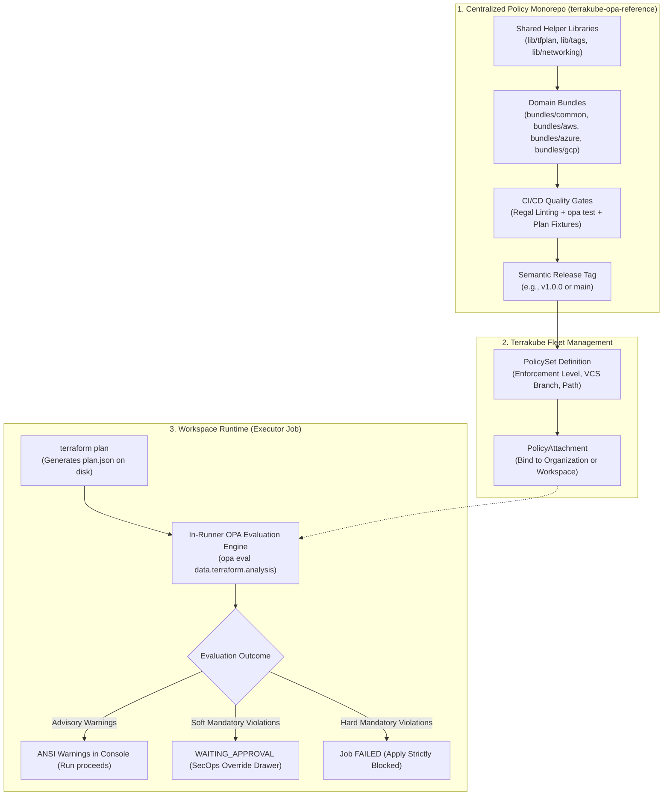

# Terrakube OPA Reference Implementation

[](https://github.com/terrakube-io/terrakube-opa-reference/actions/workflows/test.yml)
[](LICENSE)
[](https://www.openpolicyagent.org/)

A comprehensive reference implementation, best-practice repository layout, and sample guardrails library for Open Policy Agent (OPA) and Rego evaluation in [Terrakube](https://github.com/terrakube-io/terrakube).

---

> [!IMPORTANT]
> **DISCLAIMER: REFERENCE IMPLEMENTATION ONLY**  
> This repository is a **reference example** designed exclusively for demonstration, evaluation, and testing of Terrakube's OPA policy governance capabilities.
> 
> The rules, thresholds, and guardrails provided here (such as tag keys, blast radius metrics, and cloud security configurations) are illustrative samples. They are **not** intended as a drop-in replacement for an organization-specific compliance standard or production security baseline without proper tailoring, testing, and review by your SecOps and cloud architecture teams.

---

## Architecture Overview

Terrakube adopts a centralized GitOps policy model paired with in-runner execution inside both **ephemeral** (Kubernetes Jobs) and **persistent** executor containers:



---

## Directory Structure

```text
terrakube-opa-reference/
├── .github/workflows/test.yml   # CI pipeline: Regal linting + opa test
├── lib/                         # Reusable Rego helper libraries
│   ├── tfplan/                  # Terraform plan parser, change extractors, mode filters
│   ├── tags/                    # Universal tag and label validation
│   ├── blast_radius/            # Deletion counters and weighted risk scoring
│   └── networking/              # CIDR checks and sensitive port detectors
├── bundles/                     # Composable policy bundles (targeted by PolicySets)
│   ├── common/
│   │   ├── tagging/             # [Advisory] Mandatory tags (Environment, Owner, CostCenter)
│   │   ├── blast_radius/        # [Soft Mandatory] Prevents accidental bulk deletions
│   │   └── required_providers/  # [Hard Mandatory] Whitelist of approved provider registries
│   ├── aws/baseline/            # [Hard Mandatory] S3 public block, EBS encryption, IMDSv2
│   ├── azure/baseline/          # [Hard Mandatory] Storage HTTPS/TLS 1.2, restricted NSG ports
│   └── gcp/baseline/            # [Hard Mandatory] Uniform bucket access, VM public IP ban
├── fixtures/                    # Synthetic terraform show -json plan fixtures for test suites
├── examples/                    # Live Terraform workspaces demonstrating runtime outcomes
│   ├── compliant-workspace/     # Passes all policy checks
│   ├── advisory-warning-workspace/ # Emits advisory warnings without blocking
│   ├── soft-fail-workspace/     # Triggers soft mandatory override approval
│   └── hard-fail-workspace/     # Triggers hard mandatory block (exit code 1)
├── terrakube-governance/        # Terraform HCL code to manage policy sets via Terrakube Provider
├── CONTRIBUTING.md              # Policy authoring standards and contract details
└── README.md
```

---

## Pre-Packaged Policy Bundles

| Bundle Path | Target Resources | Enforcement | Description |
| :--- | :--- | :--- | :--- |
| `bundles/common/tagging` | Cloud resources | `advisory` | Warns if `Environment`, `Owner`, or `CostCenter` tags are absent. Configurable via policy inputs. |
| `bundles/common/blast_radius` | All resources | `soft_mandatory` | Halts execution for SecOps approval if `> 5` deletions or weighted risk score `> 25`. |
| `bundles/common/required_providers` | Providers | `hard_mandatory` | Disallows unapproved registries (whitelists HashiCorp, OpenTofu, and internal registries). |
| `bundles/aws/baseline` | AWS S3, EBS, EC2 | `hard_mandatory` | Requires S3 public access blocks, EBS volume encryption, and IMDSv2 tokens on EC2 instances. |
| `bundles/azure/baseline` | Azure Storage, NSG | `hard_mandatory` | Enforces HTTPS and TLS 1.2+ on storage accounts; blocks inbound SSH (22) and RDP (3389) from Internet. |
| `bundles/gcp/baseline` | GCP Storage, Compute | `hard_mandatory` | Requires uniform bucket-level access; prohibits public external IP addresses on compute instances. |

---

## Enforcement Levels Explained

Terrakube supports a three-tier enforcement model:

1. **Advisory (`advisory`)**:
   * Evaluated against `data.terraform.analysis.warn`.
   * Displays colored warning messages in the execution logs and Job Details UI.
   * Does **not** block the run; execution proceeds straight to Apply or standard Approvals.
2. **Soft Mandatory (`soft_mandatory`)**:
   * Evaluated against `data.terraform.analysis.soft_mandatory`.
   * When violations occur, the job transitions to `WAITING_APPROVAL`.
   * A user with `ManagePolicyOverride` or `SuperUser` role can inspect the violation and submit an authorized override with a mandatory justification comment.
3. **Hard Mandatory (`hard_mandatory`)**:
   * Evaluated against `data.terraform.analysis.deny`.
   * If any violations are detected, the plan step fails with exit code `1`.
   * `terraform apply` is **strictly blocked**; developers must fix the code before redeploying.

---

## Local Testing & Validation

You can run unit tests and linter checks locally using OPA and Regal:

```bash
# 1. Run all unit tests with verbose output
opa test lib/ bundles/ -v

# 2. Test a bundle against a synthetic plan fixture
opa eval \
  --data lib/ \
  --data bundles/aws/baseline/ \
  --input fixtures/aws-s3-unencrypted.json \
  --format json \
  "data.terraform.analysis"

# 3. Run Regal linter
regal lint lib/ bundles/
```

---

## Deploying to Terrakube via Infrastructure-as-Code

The `terrakube-governance/` directory provides sample Terraform code using `terrakube-io/terrakube`:

```bash
cd terrakube-governance/
cp terraform.tfvars.example terraform.tfvars
# Edit terraform.tfvars with your Terrakube API URL and Organization UUID
terraform init
terraform apply
```

This creates the Policy Sets and attaches them to target workspaces across your Terrakube organizations.
